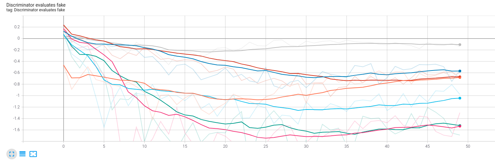
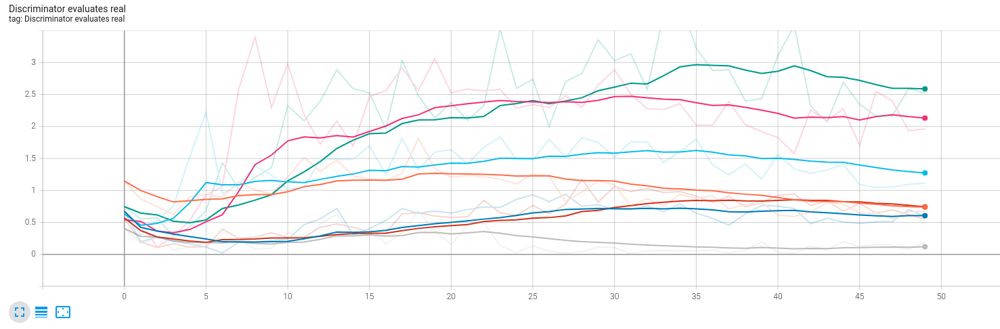

# DCGAN CLI with Examples

<!-- 


 -->

Train simple DCGAN models from the CLI while experimenting with
different hyperparameters

- Free software: MIT license
- Documentation: <https://tf-examples.readthedocs.io>.

<p align="center">
  
</p>

Frame by frame animation of training the celebA dataset for 100 epochs

## Installation

```bash
git clone https://github.com/amjack100/DCGAN-Implementation.git
cd ./dcgan
poetry install
poetry run dcgan --help
```

<!--  -->

Here are some typical trends to look for in a successful GAN training session. These graphs map the discriminator return value when evaluating fake (produced by the generator) and real entities. The different colors represent varying image resolutions of the CelebA dataset (ranging from 4x4 to the original 32x32).

<p align="center">
  
</p>
<p align="center">
  
</p>

## Credits

This package was created with
[Cookiecutter](https://github.com/audreyr/cookiecutter) and the
[audreyr/cookiecutter-pypackage](https://github.com/audreyr/cookiecutter-pypackage)
project template.
